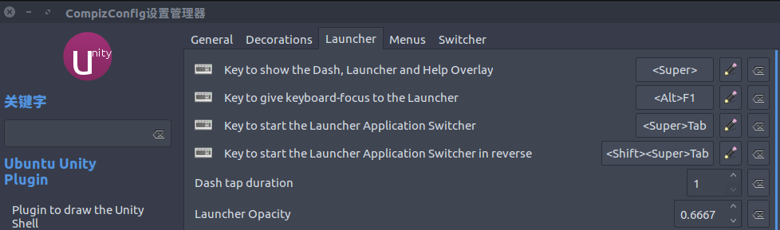
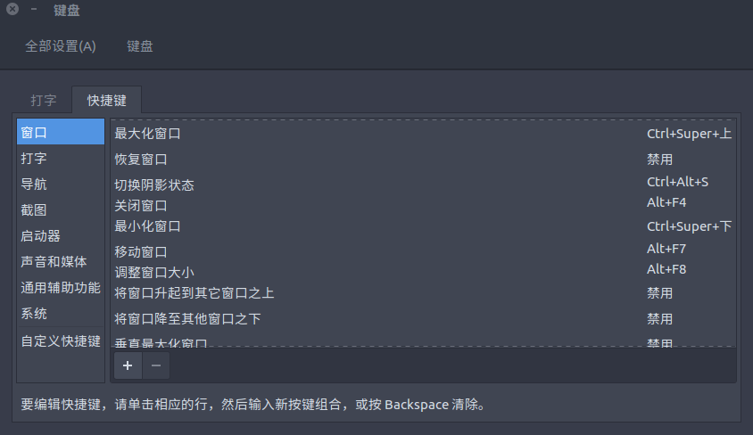

# list

1. [show all windows by moving mouse to left-bottom corner](https://askubuntu.com/questions/101310/show-all-running-windows-when-moving-mouse-pointer-to-top-left-corner-hotspot)
2. [move window to another monitor using keyboard](https://superuser.com/questions/297819/move-window-to-another-monitor-in-ubuntu-using-keyboard)
3. diable dash when tapping super key as follows:
  
4. adjust the short cut that minimizes the window:
  

